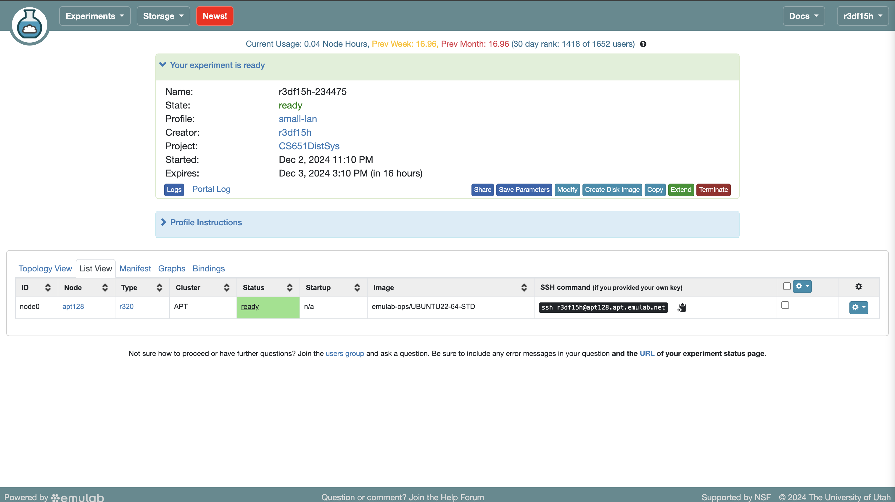
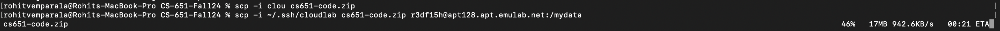
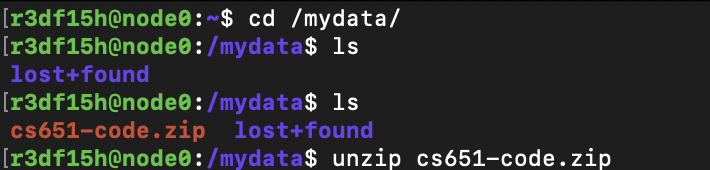

# CloudLab
CloudLab is a research platform that allows you to grab temporary use of hardware servers set up
in a small cluster for experiments. Information about CloudLab: https://cloudlab.us 

## Account Creation
Head over to https://www.cloudlab.us/signup.php?pid=CS651DistSys for account creation. For the "Project Information", you should be joining the "CS651DistSys" project.
After your account has been created, head over to https://www.cloudlab.us/ssh-keys.php in order to add public ssh-keys in order to SSH to the server you will be allocating below.

## Server Creation
Head over to https://www.cloudlab.us/resinfo.php, which lists the current set of servers available:


You can look at the status of different server types - their configuration, how many are available etc. You can choose any type of server (maybe low memory ones)

The simplest way to allocate a server for your experiment is to go to "Experiment" -> "Start Experiment", which takes you to this page: https://www.cloudlab.us/instantiate.php, the "Selected Profile" should say "small-lan". After clicking "Next", you'll be brought to the parameterize page, I would set it up as follows:


The OS will be Ubuntu 22.04 and the "Optional physical node type" tells CloudLab to pick the type of node we plan to use. We are setting the temporary file system for storing the source code

After clicking Next, you are presented with this 


I would leave it be and click "Finish". The current settings allow you to access the server for 16 hours. (I found it is easier to allocate using the default Experimental Duration provided and manually extend later as adding extra hours here can cause the admins of CloudLab to manually review your allocation and often adds overhead.)

## Server Access
After this, it'll take a few minutes for CloudLab to allocate the server 


To access the server, you can run the SSH command provided by CloudLab. Assuming you have set up the ssh-keys correctly earlier, you can pass the "-i" command to SSH to use the private keys.

Once you ssh into the server, run the following commands

```sh
sudo bash
chown -R "$SUDO_USER" /mydata/
add-apt-repository ppa:longsleep/golang-backports && apt update -y 
apt install golang-go -y
exit
```

Now in your system, navigate to the folder containing your source code and zip the folder - something like `zip -r cs651-code.zip cs651-code`

Then open the folder containing the zip file in terminal - we are going to send it to the Cloudlab server using scp


Now go back to the server, go to /mydata and unzip the source code
