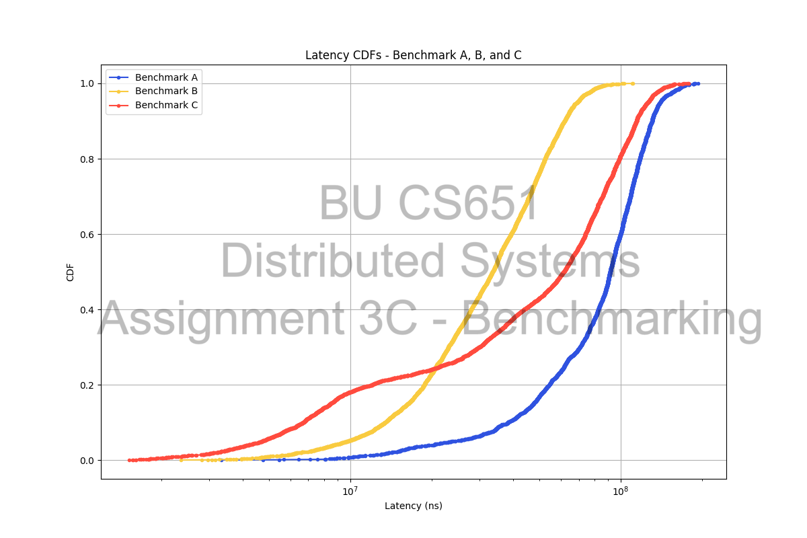
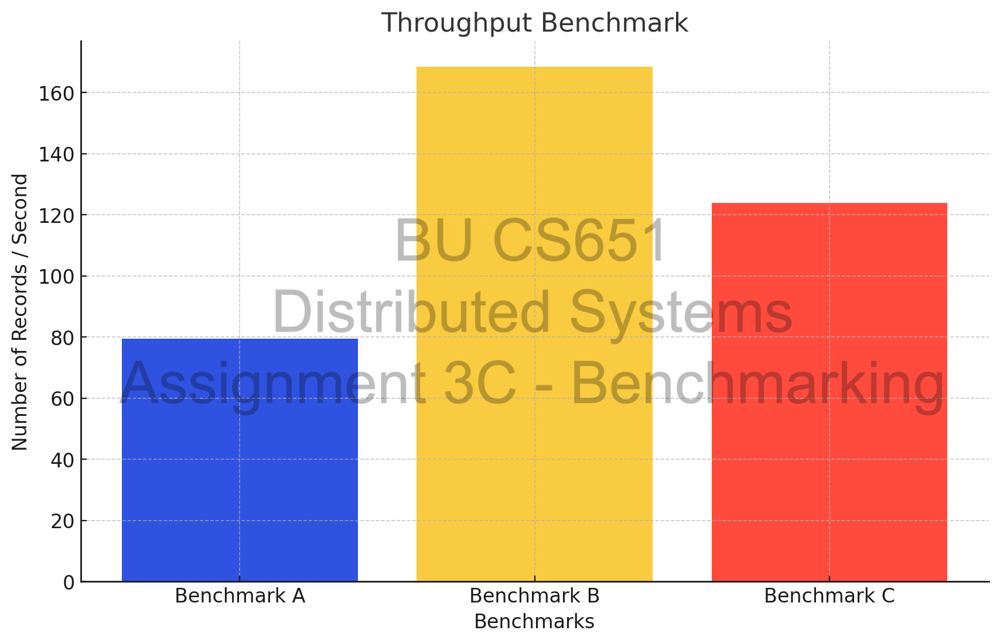

# Lab 3C: Benchmarking

## Introduction
In this lab, you will be benchmarking the performance of the KV store you previously built. The goal is to analyze how well the system works under a constant workload over a time. Specifically, you will be responsible for running 3 benchmarks from the file `benchmark_test.go`.

You will be intrumenting the following metrics and generate plots for analysing them: 
- Latency
- Average Throughput

It is entirely up to you how you choose to instrument these metrics. You can use any mechanism or library of your choice for both instrumentation and plotting graphs. Ideally, you won't need an external library for instrumentation. For plotting graphs, you may use `matplotlib`, but you are free to use any method that suits you best. 

In order to ensure that your benchmarking isn't affected my the limitations of your personal laptop or any unrelated processes running on it, you will make use of CloudLab to run the benchmarks. Please refer to [CloudlabSetup](./CloudLabSetup/CloudlabSetup.md) for steps on how to configure CloudLab. You can make all of your code changes on your laptop and then `scp` the code to a CloudLab instance for benchmarking. You can still generate the plots on your laptop itself.

## Getting Started

Do a git pull to get the latest lab software.

To get up and running, execute the following commands:

```
$ cd ~/cs651
$ git pull
...
$ cd a3b-sharding/shardkv
$ go test -run 3C_A
$ Test: Benchmark A ...
  Creating clients...
  Starting Benchmark...
    ... Done
  PASS
  ok  	cs651/a3b-sharding/shardkv	85.711s
```

This will run Benchmark A on your KV store implementation. You can similarly run Benchmarks B and C using:
```
$ go test -run 3C_B
$ go test -run 3C_C
```

When you're done, should submit a PDF file containing:
1. A CDF of the latency measurements for each of the three benchmarks (A, B and C)
2. A bar graph comparing the average throughput for each of the three benchmarks (A, B and C)
3. A to the point interpretation of these plots, and an explanation regarding the differences between the three benchmarks. You should specifically describe what Benchmarks A, B, and C are doing and why the performance with Benchmark C (red) is “somewhere between” A and B.

For consistency, please use the following colors for the following benchmarks
Benchmark| Color
------|-----|
Benchmark A | Blue
Benchmark B | Yellow
Benchmark C | Red


Note: You should only have two plots, one for latency and one for throughput. Each plot should contain data points / bars for each of the three benchmarks. You can refer to the reference following plots.







